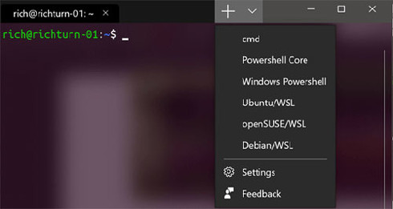

<!-- CREATED BY Marp -->
<!-- $theme: gaia -->
<!-- $size: 4:3 -->

###### 2019/06/12
### linux勉強会（クライアントサイド）
#### CUIに慣れよう
###### M1 Kinoshita Takahiro

---
<!-- page_number: true -->

## 目次
- 対象とする人
- Linuxとは
- Linuxを使うメリット
- 基本的なbashコマンド
- シェルスクリプト
- パッケージ管理システム
- まとめ

---

### 対象とする人
- 文字だけの黒い画面が怖い人
- Linuxを使ってみたい人
### 対象としない人
- バリバリCUI使ってる人
- サーバマシンとして使いたい人

## 目標
- WSL上でLinuxを使えるようになる

---

## Linuxってなに？
- Windows, Mac以外の選択肢
- ==オープンソース==なOS*
  - ソースが公開されていて誰でも開発に参加可能
  - 誰でもソースを見れるのでバグ修正などが早い
- 実際に利用するために色々な要素を付け加え
  ==Linuxディストリビューション==として配布
  - たくさんのディストリビューションが誕生(後述)
<!--*footer: * : 厳密にはOSの中核（カーネル）のみを指す-->

---

## Linuxを使う==メリット==

- 基本無料
- 軽い，低スペックでも使える
- 開発環境の構築が簡単
- 少し強くなれる
  - 調べてなんとかする力がつく
### デメリット
- Windows, Macじゃない(ソフト・ハード・情報量)

---

## ディストリビューションの種類
大きく分けると3種類(主にパッケージ管理が違う)

- Red Hat系 (Red Hatは最近IBMに買収された)
  - Red Hat Enterprise Linux(RHEL) ... 商用
  - ==Cent OS== ... RHELをOSSで再構成
- Debian系
  - Debian GNU/Linux
  - ==Ubuntu== ... ユーザフレンドリ？(GUI周りの充実)
- その他

---


<small>[GNU/Linux Distribution Timeline](https://linuxhere.wordpress.com/history-of-linux-distributions-distro/)</small>

---

## この資料での環境
Ubuntu 18.04.2 LTS on WSL
- ==Windows Subsystem for Linux==(WSL)とは
  - Windows上でLinuxをエミュレートできるやつ
    - 基本CUIだけでLinuxを使う
  - もうすぐWSL2が出るよ
    (Linuxカーネル自体を積んじゃうらしい)
- Windowsユーザ向けで話が進みます
  - MacはそもそもUnixだし

---

## 余談
Windows Terminalってやつももうすぐ出るよ
cmd / powershell / WSLが使える統合ターミナル
開発はオープンソース



---

## Linuxの基本(ファイル種類)
- ファイルの種類
  - 通常ファイル(テキスト，バイナリ)
    - 拡張子に特に意味はない(見やすいだけ)
    - 「.」から始まるファイルは隠しファイル
  - ディレクトリ
  - リンクファイル(シンボリック，ハード)
- コマンドによる確認は後述

---

## Linuxの基本(ユーザ・グループ)
Linuxには複数ユーザ・グループが存在する
- 管理者ユーザ(俗に言う root) ... なんでもできる==神==
- 一般ユーザ ... 普段はここを使う
- システムユーザ
  - アプリケーションを動かしてるアカウント
- グループ
  - ユーザが所属するグループ

操作権限をユーザ・グループに対して付与する
<!--*footer:https://kazmax.zpp.jp/linux_beginner/lin1.html#an2-->

---

## Linuxの基本(ディレクトリ構造)
Linuxは[階層ディレクトリ構造](https://www.linuxmaster.jp/linux_skill/2010/02/06linux.html)
```bash
/
├ bin/  ... 一般ユーザ向けの基本コマンド
├ boot/ ... 起動に必要なファイル
├ dev/  ... デバイスファイル
├ etc/  ... システム設定ファイルや起動スクリプト
├ home/ ... ユーザのホームディレクトリ `~`で表される
├ lib/  ... 共有ライブラリ置き場
├ media/... リムーバブルmediaのマウント場所
├ mnt/  ... ファイルシステムの一時的なマウント場所(WSLでは重要)
├ proc/ ... プロセス情報
├ root/ ... root用ホームディレクトリ
├ sbin/ ... root用のシステム管理コマンド
├ tmp/  ... ファイルの一時保管場所
├ usr/  ... 各種プログラムやライブラリ，ドキュメントなど
└ var/  ... ログなど動的に変化するファイル
```

---

## Linuxの基本(ディレクトリ構造)
WSLにおいてはWindows環境が`/mnt`以下に格納
```bash
/
└ mnt/
    ├ c/
    └ d/
```
ホームディレクトリ`~`にWindowsのlinkを伸ばすと楽
```bash
$ ln -s /mnt/c/Users/kinoshita/Desktop ~/desktop
```
`ln`コマンドはシンボリックリンクを作成する

---

## Linuxの基本(コマンド)
Linuxは基本的にコマンドで操作する
```bash
$ コマンド [オプション] [引数]
```
##### これだけ覚えておけ集(オプションは調べてね)
```bash
cd    ... ディレクトリ移動
ls    ... ファイル一覧
cat   ... ファイルの中身を見る
cp    ... ファイルコピー
mv    ... ファイル移動・リネーム
rm    ... ファイル削除
mkdir ... ディレクトリ作成
alias ... エイリアス作成
grep  ... 文字列サーチ
echo  ... 標準出力する
```

---

## そもそもコマンドって何？
- コマンド
  - して欲しい動作をシェルに伝えるもの
- シェル
  - カーネルに伝えるプログラムを探し出して実行

Linuxでは標準的にbashというシェルが使われる

macOS 10.15 Catalinaでbashからzshに変更らしい

---

## Linuxの基本(便利コマンド集)
使えると便利なコマンドたち
わからないコマンドがあれば，ググるか
`--help`オプションを使うか`man`コマンドを使う

```bash
man  ... コマンドの説明書が見られる
gzip ... ファイル圧縮
tar  ... ディレクトリをまとめる，オプションによってgzipも同時に可能
wget ... HTTP接続でダウンロード
ssh  ... リモート接続
scp  ... リモート先からローカルにデータコピー
diff ... 2ファイルの差分を表示する
```

---

## Linuxの基本(リダイレクト)
普通コマンドの結果は標準出力される
```bash
$ echo Hello!
Hello!
```
リダイレクト`>`, `>>`を使うとファイル出力できる
```bash
$ echo Hello! >> ~/hello.txt
$ echo Hello! >> ~/hello.txt
$ cat ~/hello.txt
Hello!
Hello!
```
`>`は上書き，`>>`は追記する

---

## Linuxの基本(パイプ)
パイプ`|`はコマンドの出力結果を別コマンドに渡す
```bash
$ ls /etc
NetworkManager          hostname      
X11                     hosts         
acpi                    hosts.allow   
... ...
```
ここでは`.conf`ファイルのみを出力する
```bash
$ ls /etc | grep .conf
adduser.conf
ca-certificates.conf
debconf.conf
deluser.conf
```

---

## Linuxの基本(権限)
```bash
$ ls -l /etc
drwxr-xr-x 1 root root   4096 May 21 23:40 acpi
-rw-r--r-- 1 root root   3028 May 21 23:39 adduser.conf
```
`ls -l`をすると，ファイル詳細が見れる
`drwxr-xr-x`は以下を意味する
- d:ディレクトリ(-:通常ファイル，l:リンク)
- user: readable, writable, executable
- group: readable, -, executable
- other: readable, -, executable

---

## Linuxの基本(権限操作)
`chmod`は権限を操作できる
rwx(u)rwx(g)rwx(o)を2進数と見立てて操作できる
755(10) = 111(2)101(2)101(2) = rwxr-xr-x
```bash
$ ll  <- ls -al のalias
-rwxr-xr-x 1 ubuntu ubuntu   73 Jun  3 16:09 loopls*
```
```bash
$ chmod 777 loopls
-rwxr-xr-x 1 ubuntu ubuntu   73 Jun  3 16:09 loopls*
```
```bash
$ ll
-rwxrwxrwx 1 ubuntu ubuntu   73 Jun  3 16:09 loopls*
```

---

## Linuxの基本(メタキャラクタ)
標準で使える正規表現的なもの
```bash
*  ... 0文字以上の任意の文字列
?  ... 任意の1文字
[] ... []内の任意の1文字
[^]... []内の文字を除く任意の1文字
```
```bash
$ ll
-rw-rw-rw- 1 ubuntu ubuntu  261 Jun  3 15:06 date.txt
-rwxrwxrwx 1 ubuntu ubuntu   73 Jun  3 16:09 loopls*
-rw-rw-rw- 1 ubuntu ubuntu   20 Jun  3 16:15 sort.dat
-rw-rw-rw- 1 ubuntu ubuntu   19 Jun  3 16:14 test.dat
```
```bash
$ ll *.txt
-rw-rw-rw- 1 ubuntu ubuntu  261 Jun  3 15:06 date.txt
```

---

## Linuxの基本(エイリアス)
長いコマンドは何回も打ちたくない
:arrow_right: エイリアスを使って短縮できる
```bash
$ cat sort.dat
1:one
2:two
```
```bash
$ alias cs='cat sort.dat'
$ cs
1:one
2:two
```
`alias`は起動中しか効力がないので起動のたびに
宣言する必要がある :arrow_right: 次スライド

---

## Linuxの基本(起動時設定)
`~/.bashrc`は起動時に読み込まれるファイル
ファイル内に起動中に使いたい設定を書き加える
```bash
# エディタはvimでもviでもemacsでもnanoでもなんでも良い
$ vim ~/.bashrc
```
以下の記述もデフォルトでされている
```bash
# some more ls aliases
alias ll='ls -alF'
alias la='ls -A'
alias l='ls -CF'
```

---

## Linuxの基本(パスの通し方)
ついでにパスの通し方も説明
パスは`PATH`という変数に全て記述されている
```bash
$ echo $PATH
/usr/local/sbin:/usr/local/bin:...
```
変数宣言`export`コマンドでPATHに追加する
```bash
$ export PATH=$PATH:[追加したいパス]
$ echo $PATH
/usr/local/sbin:/usr/local/bin:...[追加したいパス]
```
前スライドと同じように`~/.bashrc`に
`export PATH=$PATH:[追加したいパス]`を書き加える

---

## Linuxの基本(パスの通し方)
`~/.bashrc`をエディタで開くのも面倒
リダイレクトを使って下記のように書き込める
```bash
$ echo "alias test_alias='ls -a'" >> ~/.bashrc
$ echo 'export PATH=$PATH:[追加したいパス]' >> ~/.bashrc
```

---

## シェルスクリプト
毎回似たようなコマンド書くの面倒臭くない？
:arrow_right: バッチファイル的なの書きましょう
書かれていることを上から実行するだけ
```bash
$ vim ./gpp.sh
#!/bin/bash
if [ $# -ne 1 ]; then
	echo "need arg '*.cpp'"
	exit 1
fi
mkdir -p ./bin
filename=`basename $1 .cpp`
g++ ./$filename.cpp -o ./bin/$filename && ./bin/$filename

$ chmod 755 ./gpp.sh   # 実行権限を与える
$ ./gpp Sample_source  # スクリプト起動
```

---

## Linuxの基本(パッケージ管理)
Linuxではパッケージとしてソフトを管理している
==Ubuntu==では`apt`を使ってパッケージを管理する
`apt`がパッケージごとの依存関係を解決してくれる
~~apt-getはもう終わった~~
主要`apt`コマンド
```bash
apt update  ... パッケージリストの更新
apt upgrade ... リストに従ってパッケージを更新する
apt install ... パッケージをインストール
apt search  ... パッケージを検索
```
上記操作は権限(==permission==)がなんとか言われるかも
`sudo`をつけるか`sudo su -`でrootユーザに移行する

---

## Linuxの基本(パッケージ管理)
`apt`はリポジトリからパッケージを持ってきている
デフォルトだと海外のリポジトリなので遅い
下記は日本のリポジトリに変更するコマンド

<code style="font-size:60%">
$ cd /etc/apt<BR>
$ sudo sed -i.bak -e "s/http:\/\/archive\.ubuntu\.com/http:\/\/jp\.archive\.ubuntu\.com/g" sources.list<BR>
$ sudo apt update && sudo apt -y upgrade<BR>
</code>

まとめてインストール可能
```bash
$ sudo apt install make, git, wget, curl
```

---

## まとめ
- Linuxは自由度が高いOSである
- ディストリビューションが豊富にあり
  用途によって使い分けられる
- コマンドがめちゃくちゃあるので
  よく使うやつだけ覚えてあとは調べつつ使う
- 絶対使ったほうが良いというわけではなく
  選択肢の一つとして考えられるようになると良い

今回の内容は一部PowerShellとかでも動くので
CUIを使ってみてください！

---

## 参考
Windows Subsystem for Linuxを
インストールしてみよう！ - Qiita
https://qiita.com/Aruneko/items/c79810b0b015bebf30bb
たった2日でわかるLinux(図書館に所蔵)
https://www.shuwasystem.co.jp/book/9784798042565.html
Ubuntu 18.04のWSL上へのインストールと初期設定
http://www.aise.ics.saitama-u.ac.jp/~gotoh/HowToInstallUbuntu1804OnWSL.html

---
## omake
`#`解除でbashに色が付き見やすい
```bash
$ vim ~/.bashrc
# line 46
force_color_prompt=yes
```
pyenv インストール
<code style="font-size:60%">
$ git clone git://github.com/yyuu/pyenv.git ~/.pyenv<BR>
$ git clone https://github.com/yyuu/pyenv-pip-rehash.git~/.pyenv/plugins/pyenv-pip-rehash<BR>
$ echo 'export PYENV_ROOT="$HOME/.pyenv"' >> ~/.bashrc<BR>
$ echo 'export PATH="$PYENV_ROOT/bin:$PATH"' >> ~/.bashrc<BR>
$ echo 'eval "$(pyenv init -)"' >> ~/.bashrc<BR>
$ source ~/.bashrc<BR>
</code>
